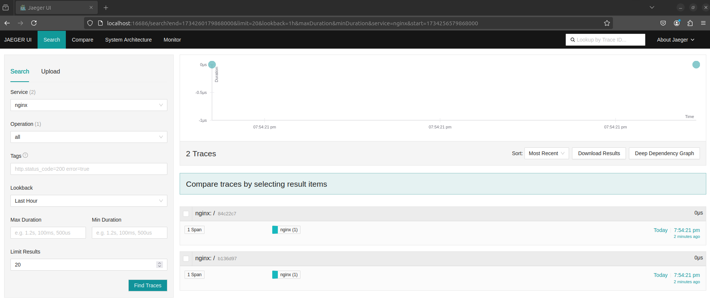

# nginx-opentelemetry-demo

**nginx-opentelemetry-demo** is a simple distributed tracing demo using NGINX and OpenTelemetry.

## Features

- Collect tracing data with OpenTelemetry
- Configure tracing in NGINX
- Visualize tracing data using Jaeger
- Easy setup with Docker Compose

## Prerequisites

Ensure you have the following tools installed:

- [Docker](https://docs.docker.com/get-docker/)
- [Docker Compose](https://docs.docker.com/compose/)

## Steps

1. Clone this repository:

   ```bash
   git clone git@github.com:chaya2z/nginx-opentelemetry-demo.git
   cd nginx-opentelemetry-demo
   ```

2. Start the containers using Docker Compose:

   ```bash
   docker compose up
   ```

3. Access Nginx in your browser ([http://localhost](http://localhost))

4. Access Jaeger's UI in your browser ([http://localhost:16686](http://localhost:16686)) to view the tracing data.

   Select Nginx in Service and press "Find Traces" button.
   

> [!IMPORTANT]
> If you do not have Nginx in Service, please access Nginx again ([http://localhost](http://localhost)). Also, check the logs.
